# Unorganized thoughts around ACIBOOTSTRAP app


# AS Doc Review

## [COX ACI POC Test Plan](https://cisco.box.com/s/i6mgtdth627u8ot3oqon5fev36ay8cqc)
* Day 1
  * 1.2 - Fabric Discovery
    * 1.2.2.1 - Go through APIC1 setup wizard **(Manual)**
      * Good notes around defaults and suggested values
    * 1.2.2.2 - Fabric Discovery
  * 1.3 - Access Policies Config
    * ***1.3.4 - When were the OOB Policies set?***
      * Script -> Setup OOB Policies
    * Interface Policies
      * CDP Enable
      [cdpIfP-CDP_ENABLE.json](files/configs/base/cdpIfP-CDP_ENABLE.json)
      * CDP Disable
      [cdpIfP-CDP_DISABLE.json](files/configs/base/cdpIfP-CDP_DISABLE.json)
      * LLDP Enable
      [lldpIfP-LLDP_ENABLE.json](files/configs/base/lldpIfP-LLDP_ENABLE.json)
      * LLDP Disable
      [lldpIfP-LLDP_DISABLE.json](files/configs/base/lldpIfP-LLDP_DISABLE.json)
      * LACP
        * LACP Active
          * [lacplagp-LACP_ACTIVE.json](files/configs/base/lacplagp-LACP_ACTIVE.json)
        * LACP MAC Pinning
          * [lacplagp-MAC_PINNING.json](files/configs/base/lacplagp-MAC_PINNING.json)
    * 1.3.6 - Build Interface Policy Groups
      * 1.3.6.1 - VPC policy for UCS
        * Optional setup I think...not easily scriptable, but these steps are good showing how to create VPC, how to create Int Profile, Switch Profile and AEP
        * May replace this for BM single connections?
  * Missing items:
    * Polcices for APIC interfaces?
* Day 2
  * 1.4 - Building Fowarding (Logical) Constructs
  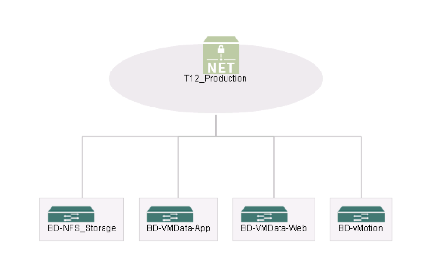
    * This assumes VMware integration
    * 1.4.5 - Tenant Creation
      * ***I'd ignore the Security Domains***
    * 1.4.6 - Create VRF
    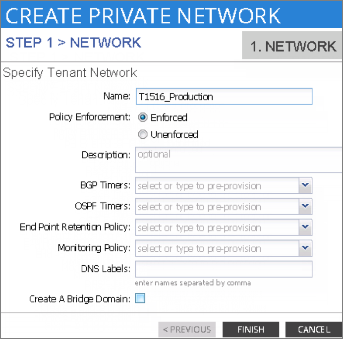
      * [ ] Build JSON
    * 1.4.7 - Create BD and Subnets
      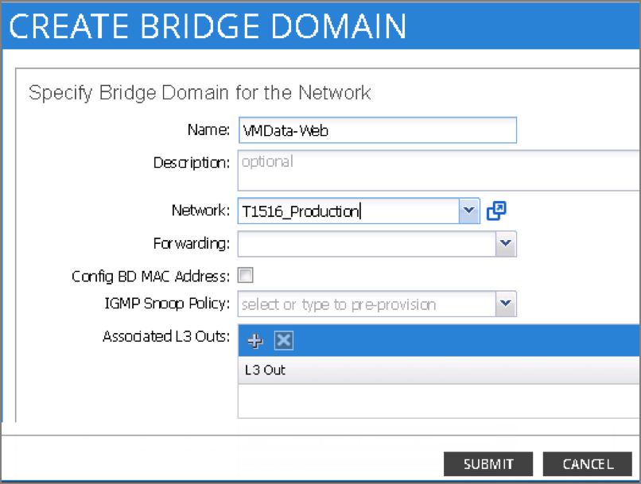
      * [ ] Build JSON

      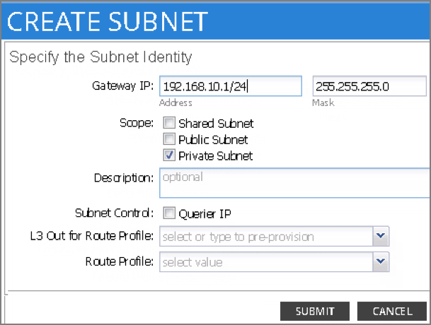
      * [ ] Build JSON
      * Repeat for another App and vMotion
      * Create Web BD
      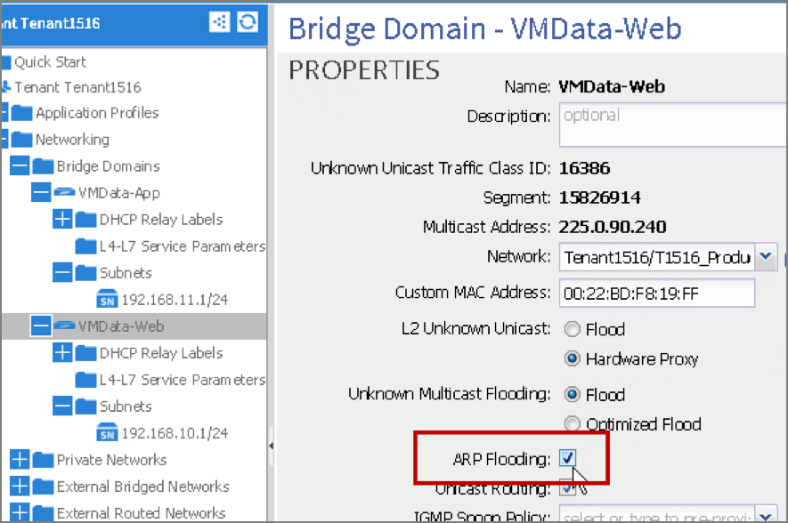
      * [ ] Build JSON
      ***Revisit how they created the Subnets, who's DG etc***
      * Create NFS BD
      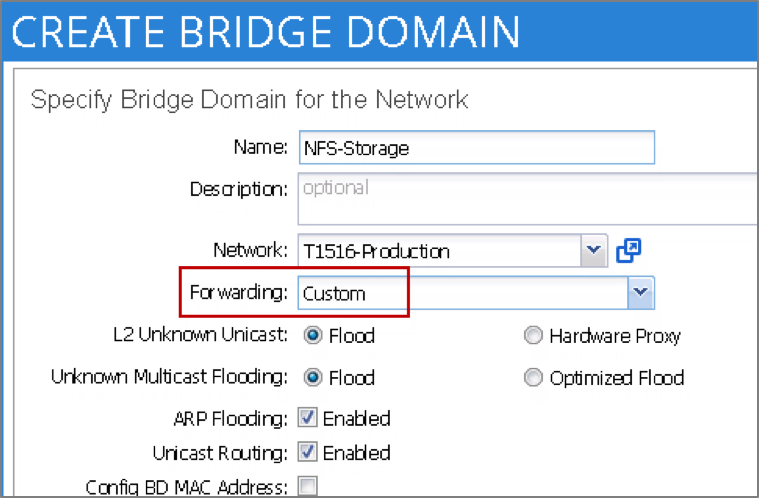
      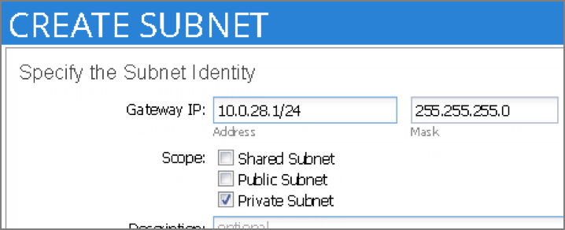
  * 1.5 Build Application Profile
    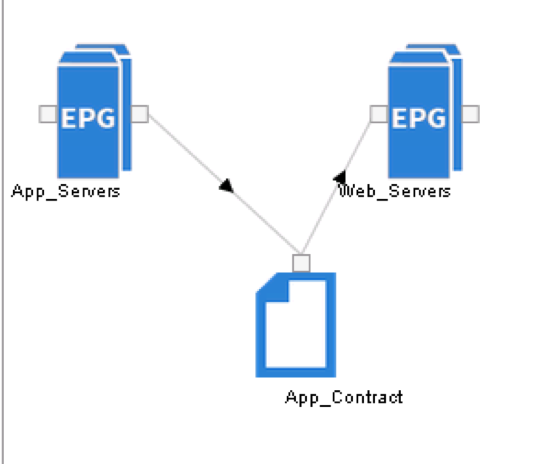
    * Create Web and App EPG's and map to associated BD's
    * Create Contracts

      | Contract | Subjects | Filters | Entities |
      | --- | --- | --- | --- |
      | APP_Contract | APP_Services | APP_Service_Ports | ICMP <br> TCP5000 |
    * Provide APP_Contract from APP
    * Consume APP_Contract from Web
  * 1.5.5 VMM integration
    * Steps are good and clear
    * Uses VDS
      * ***I agree with this unless customers wants AVS***
  * 1.6.3-4 Setup L2 out
    * ***Takes a bit more planning work than L3 I think***
* Day 3
  * 1.6 - Setup L3 out
  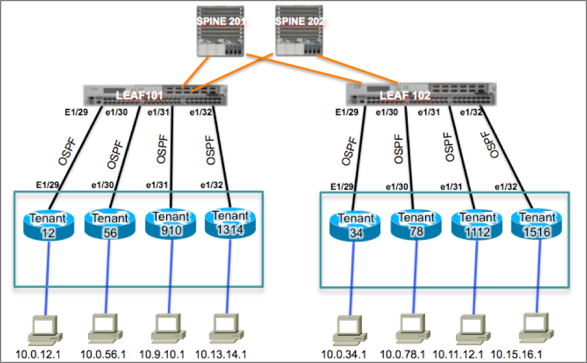
    * Setup using OSPF and default 0.0.0.0/0 external Network
    * Uses routed sub-interface
    * Sets up new Contracts for web -> out
    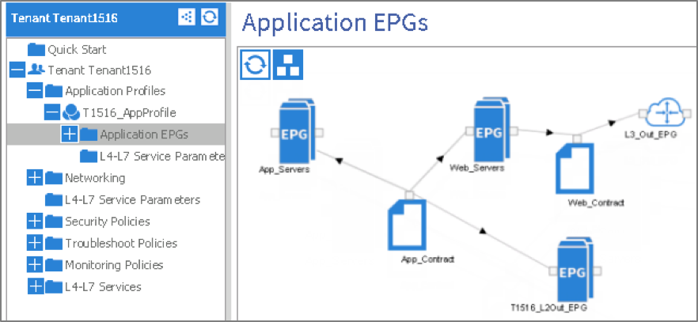
    * Associates WebBD with new L3 out
    * Advertise WebBD Subnet (public subnet scope)
    * Change WebBD subnet and AppBD Subnet to use L3 out for "L3 Out for Route Profile"
* Day 4
  * Service Insertation ***(Should not cover in standard POC)***
* Day 5
  * Software upgrade ***(should be covered)***
  * Switch replacement ***(Should not be covered)***

## Section 2 POC Methodology
* Test Setup
  1.	Verify that the ACI fabric is up and running using the topology screen under the fabric tab.
  2.	Verify that the LLDP/CD neighbors are seen (i.e. the UCS Fabric Interconnects, HP Rackmount servers hosting ESXi)
  3.	Verify using ICMP and HTTP(s) that data plane functionality is working for the remainder of the tenants in the fabric (Tenant01 / Tenant02).
  4. Ensure that these pings are running with the continuous flag set to verify that there is no data plane functionality loss for these tenants at the end of this test case.
* Procedure
  1.	Obtain out of band access for each APIC server.
  2.	Verify the current state of the tenants on the APIC by click on Teants > All Tenants
  3.	Obtain the IP/VLAN information to be used for the Web tier, App tier, the /30’s on the external connectivity leg, the loopback addresses for the ACI border leaf and the Nexus 7000 and the verification subnet outside the fabric.
  4.	Create a new Tenant named Tenant03 using the steps outlined in the section Day 2 Part 1: Build ACI Forwarding Constructs
  5.	Create a new application profile named App01 for Tenant03 using the steps outlined in the section Day 2 Part 2: Configuring Application Profile
  6.	Verify that the appropriate port-groups as defined in the application profile (in step 5 above) are now available in Vcenter as a port group under the DVS created by APIC. The configuration / verification steps outlined in the section Day 2 Part 3: Configuring VMM Integration can be used to accomplish this.
  7.	Create an L3-Out connectivity profile for this Tenant using the steps outlined in the section Day 3 Part 1: Connecting Layer 3 Outside
  8.	Verify the ability ACI Attach a web VM and an App VM to the respective port-groups in Vcenter once created.
  9.	Verify the ability to ping the default gateway on the respective bridge-domains on the VM console session.
  10.	Verify the ability to ping through the external network a VM in the Web EPG.
  11. Verify the ability to open up a HTTP session to the VM in the Web EPG.


Items Missing:
* Setup BGP RR
* Create another Tenant for "switched Fabric" with routed SVI outside of ACI
* Setup external switch or BM server


APIC1 wizard
Fabric Discovery


---

### Items Included
* Raspberry pi
  * Webserver for files
  * ACIBOOTSTRAP python or Newman Postman or Postman collection + XLS type sheet
  * Reason:
    * Infra team may not have HTTP or SCP server available for use as an image repository
    * ACIBOOTSRAP may need a specific version of code running on APICs for the bootstrap process, code can be shipped with the PI
    * Cobra SDK must match APIC code
    * No need to mess with CSE's laptop to ensure they have correct version of Python or Docker
    * Cost ~= $50

### Items needed to build system and TEST
* [ ] 3 node APIC cluster
* [ ] 2 spines
* [ ] 2 leafs
*  Must be able to be wiped at anytime for testing


### Pre-work Items for customer
* [ ] Rack all APICs, Leafs, and spines
* [ ] Cable all Leafs and spines
* [ ] Cable all APIC, Leafs, and spines mgmt ports to oob Network
* [ ] CIMC IP for all apic
* [ ] OOB IP for all APIC, Leaf, and spines
* [ ] IP for PI
* [ ] NTP
* [ ] Subnet(s) for POC BDs
* [ ] Vmware IP and creds
  * [ ] Test VM's x3
* [ ] /30's for External
* [ ] Loopback addressses for ACI Leaf for routing protocol
* [ ] Routing protocol info (EIGRP / OSPF)

### POC Final state
* Fabric Discovery
* Fabric Base Config
  * OOB
  * NTP
  * BGP
* VMM
* APIC CIMC access
* Fabric Access Policies
  * Interface policies
    * [x] Link Level
    * [x] CDP
    * [x] LLDP
    * [x] Port Channel
    * [x] STP
* Fabric Pod Policies
  * NTP Timezone
    * [ ] Dynamic enter TZ info
  * NTP Server
    * [ ] Dynamic enter TZ info
  * BGP
    * [ ] Dynamic ask for AS number
    * [ ] Set to 201 and 202
  * DNS
    * [ ] Dynamic ask for domain
    * [ ] Dynamic ask for provider
    * [x] Set to use OOB
  * Fabric L2 MTU


POC Topology Lab Bundle
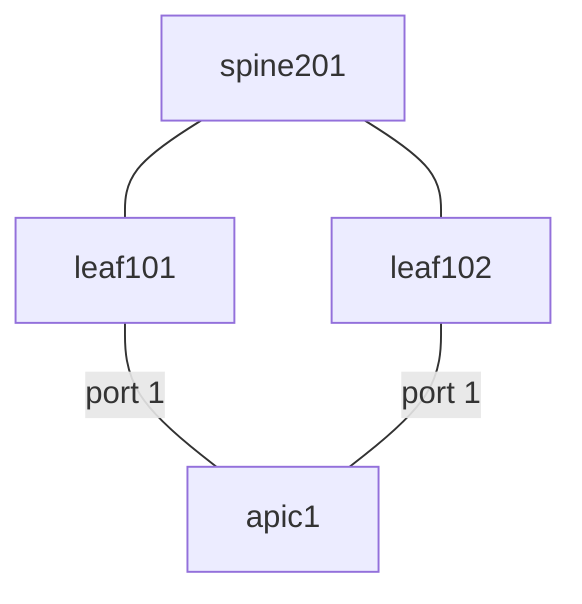

POC Topology Starter Bundle
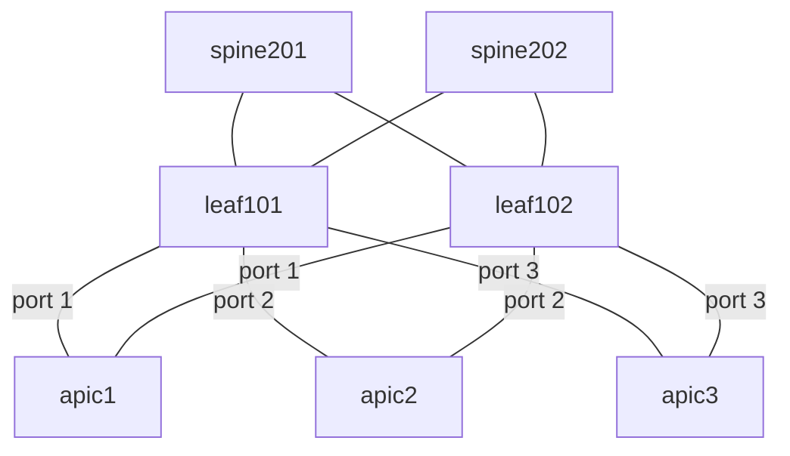

## Topology for use with ACIBOOTSTRAP

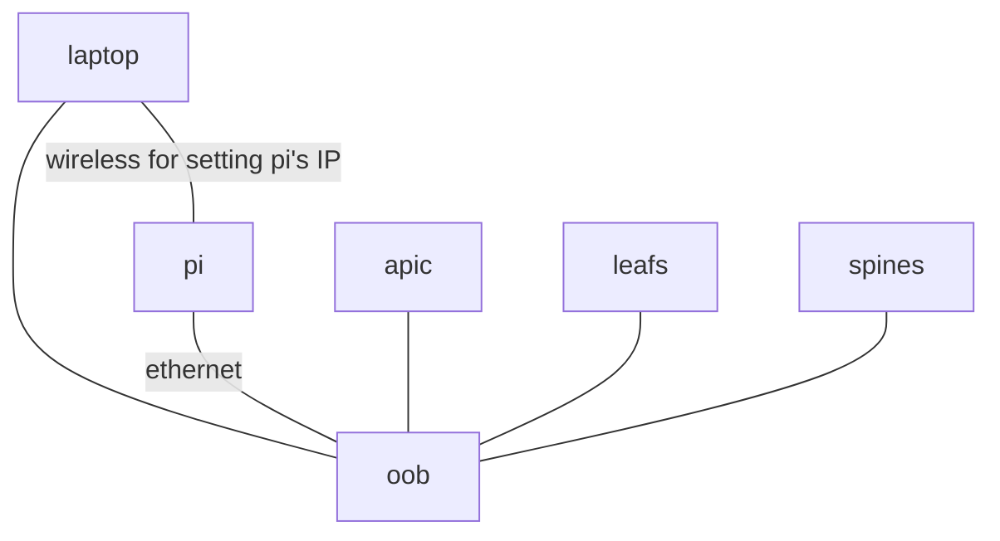

# Requirements
* 2.2.1n

## Customer Pre-work before running ACIBOOTSTRAP
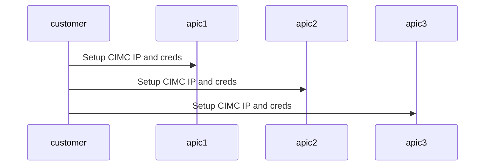
## Overview steps
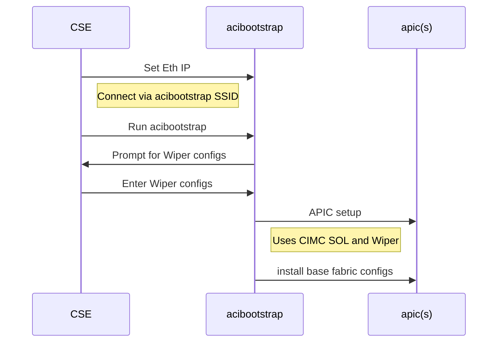
---
## ACIBOOTSTRAP Detail Steps
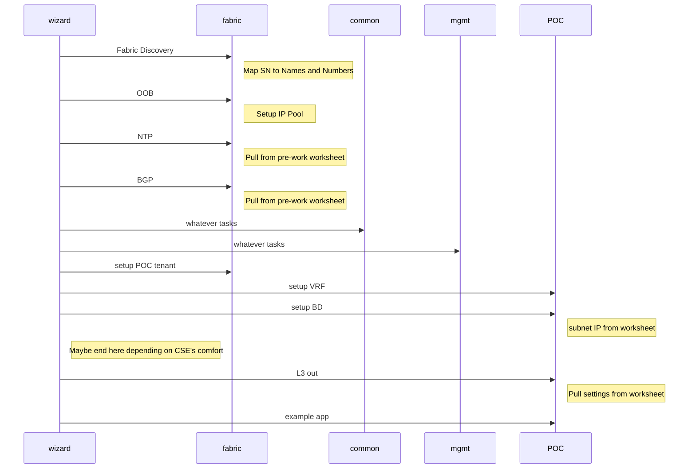

```mermaid ACIBOOTSTRAP
sequenceDiagram


```

Horizontal Scale
In service upgrade
